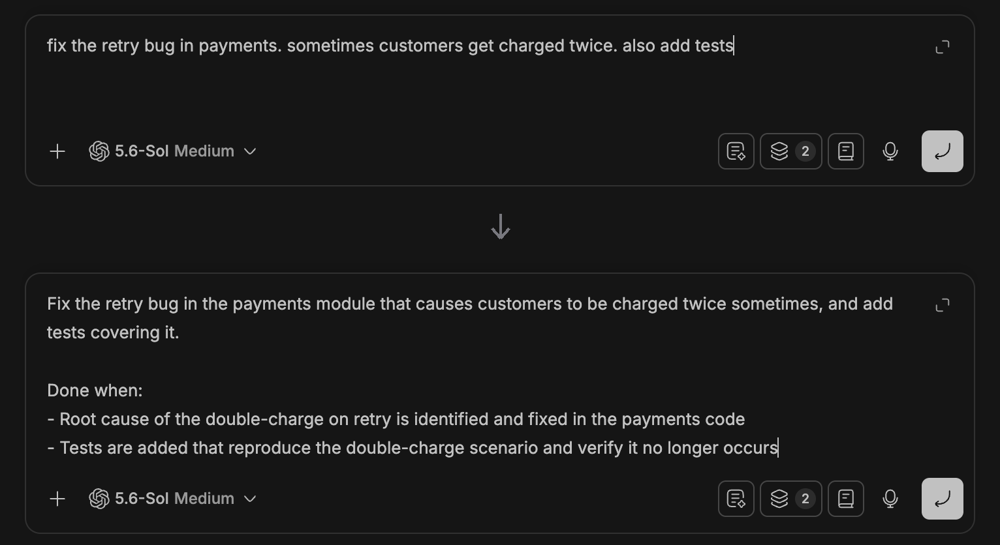
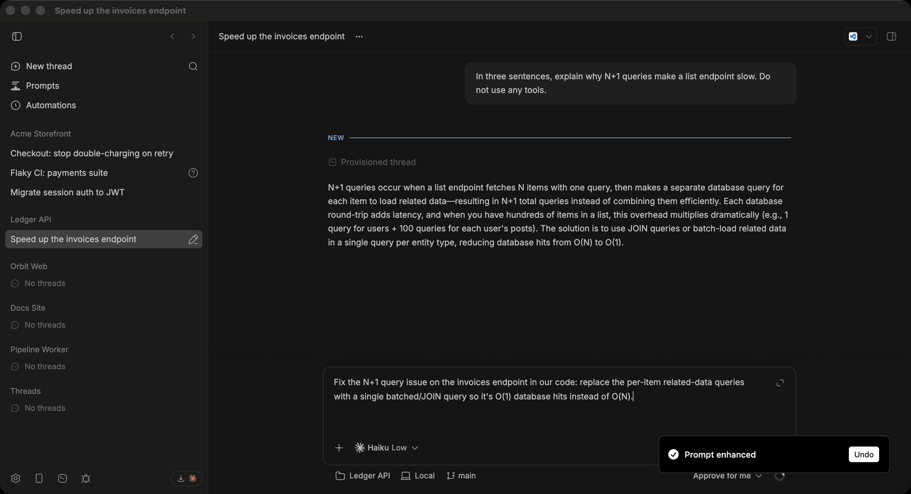
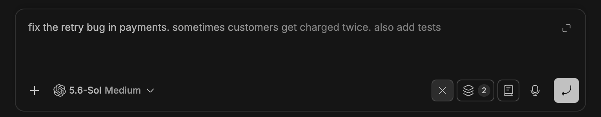
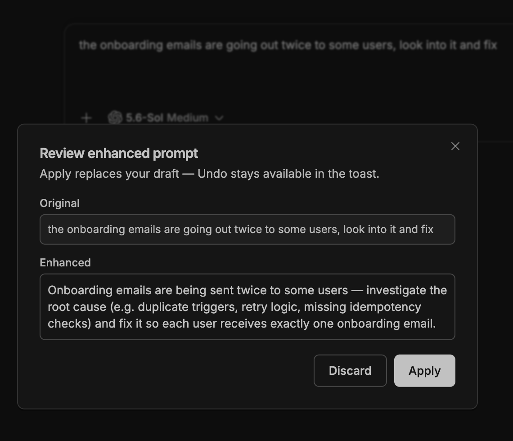
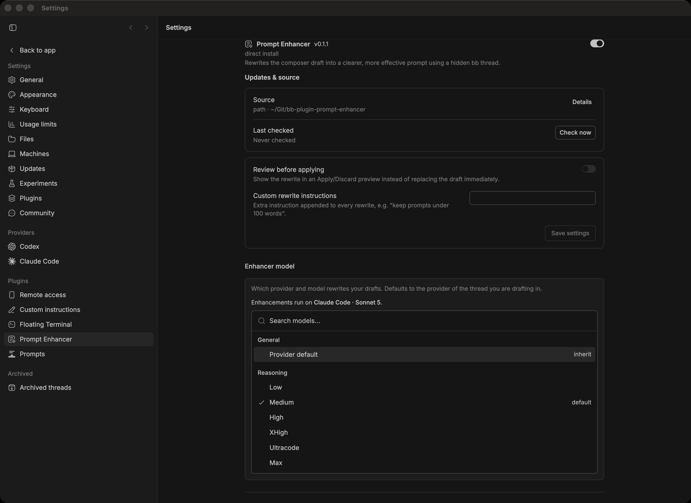

# Prompt Enhancer

A spark button in every [bb](https://getbb.app) composer that rewrites your
rough draft into a prompt worth sending — in place, in the composer you are
already typing in.

The rewriter is a hidden bb thread, so it runs on the provider you already
have configured. No API keys, no external service, nothing leaves your bb.



## Install

Find it in **Settings → Community** once the marketplace listing lands, or
install it straight from git today:

```
bb plugin install git:https://github.com/vburojevic/bb-plugin-prompt-enhancer.git@main
```

`bb` git installs take an explicit ref, so pin a release instead if you prefer:
`…bb-plugin-prompt-enhancer.git@v0.2.1`.

Then click the spark in any composer — or press **⌘E** (**Ctrl+E** on
Windows and Linux) while the composer is focused.

## It picks the shape from the draft

The rewriter is not told "make it longer". It is told to read the draft and
choose: a simple ask stays roughly one line, and only genuinely multi-part
work earns a brief with a `Done when:` list.

That distinction is what keeps it usable on every message rather than only on
the first one.

| You type | You get |
| --- | --- |
| `fix the retry bug in payments. sometimes customers get charged twice. also add tests` | A brief with the goal restated precisely and a two-item `Done when:` list |
| `ok fix that in our code` | One sharpened line — still one line |

## Follow-ups know where they are

A draft written mid-conversation is a *follow-up*: the agent already holds the
context, so inflating it into a standalone spec re-litigates settled ground.
The plugin detects that case and tells the rewriter to keep it a follow-up.

It also passes the thread title and the tail of the last assistant message —
used **only** to resolve vague references. Here `that` becomes the actual N+1
problem the agent just described, and the result is still a single sentence:



## Your references survive

The rewriter is instructed to preserve verbatim every `@mention`, file path,
identifier, code span, shell command, URL, and quoted string — they are live
references, not prose.

Then the plugin checks. It re-extracts those references from your original and
verifies each one survived, using the composer's own structured `@`-mentions as
ground truth rather than guessing from the text. Anything that went missing
gets called out in a warning toast before you send:

> The rewrite may have dropped: `src/checkout.ts`, @readme — check before sending.

Attachments are counted and declared to the rewriter too, so it never invents
or drops a reference to a file it cannot see.

## Nothing is lost while it runs

While a rewrite is in flight the draft locks and shimmers — one highlight band
sweeping the whole draft, anchored to the viewport so it stays a single band no
matter how many spans the editor splits your text into. The spark becomes a
cancel button:



A run belongs to the **composer draft, not to the screen**. Leave the thread
mid-rewrite and it keeps going; come back and it is still there — still
shimmering if it is running, typing itself in if it finished while you were
away. The same holds across a window reload, a plugin reload, and a second
window, because the server looks a run up by composer scope instead of the tab
remembering it.

Nothing ends a run except you cancelling it or the server giving up. The
predicted duration only paces the animation — a rewrite that runs long is
waited out, not reaped. That prediction adapts per model from recent measured
completions rather than a flat 90-second ceiling, so a fast model fails fast
and a slow one is given room.

When the rewrite lands, the toast offers **Undo** to restore your original
draft. Hidden enhancement threads are stopped and deleted the moment they
resolve, so they never pile up in your thread list.

## Review before applying

Prefer to look before it touches your draft? Turn on **Review before applying**
and every rewrite arrives in an Apply/Discard preview showing both versions —
with the dropped-reference warning inline, if there is one.



## Choose what rewrites your drafts

By default the rewrite runs on the provider of the thread you are drafting in
(or the project default on the new-thread composer), at that provider's default
model.

Pin something else under **Settings → Prompt Enhancer**. Picking a model
reveals its reasoning levels in their own group — the same progressive
disclosure bb's own model picker uses. It lives in settings rather than beside
the draft because it is a set-once preference: the composer keeps a single
button.



**Custom rewrite instructions** appends a standing instruction to every rewrite
— `keep prompts under 100 words`, `always write in German`, whatever you keep
asking for.

Both are also reachable from the CLI:

```
bb plugin config prompt-enhancer
bb plugin config prompt-enhancer set previewBeforeApply true
bb plugin config prompt-enhancer set customInstructions "keep prompts under 100 words"
```

## Details

- **Motion** — every animation collapses to an instant text swap under
  `prefers-reduced-motion`.
- **Long drafts** — the draft is capped at 8000 characters in the rewrite
  prompt; custom instructions at 500, so they can't dominate it.
- **Language** — the rewrite stays in the language the draft was written in.
- **Enhance while busy** — you can enhance a draft while the agent is still
  running its previous turn.

## Development

```
npm install
npm test              # pure logic in lib/, on Node's built-in test runner
bb plugin build       # dist/server.js + dist/app.js
bb plugin install .
bb plugin reload prompt-enhancer
```

The interesting logic is pure and unit-tested in `lib/`: prompt construction,
the dropped-reference guard, reveal pacing, adaptive timeouts, composer-scope
identity, and what an expired deadline means. `server.ts` owns all I/O;
`app.tsx` owns the composer UI.

`types/` holds the bundled bb plugin API declarations, mapped to
`@bb/plugin-sdk` by `tsconfig.json`. Refresh them from your bb with
`bb plugin types` (`--check` in CI).

## License

MIT — see [LICENSE](LICENSE).
